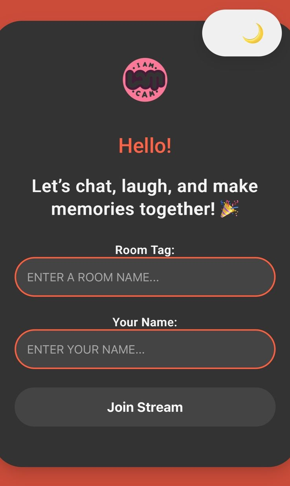
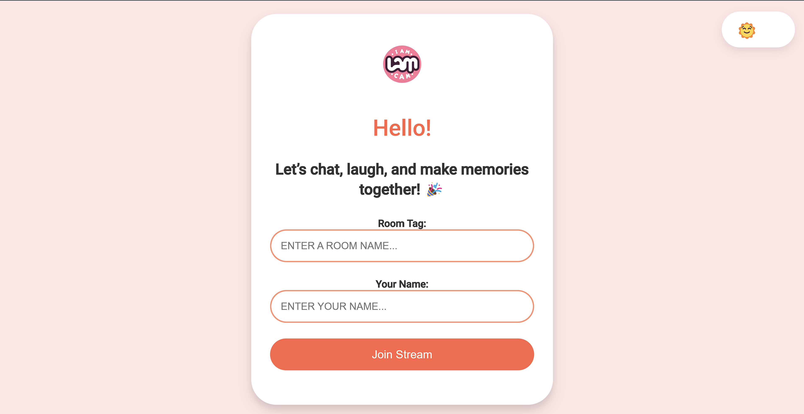
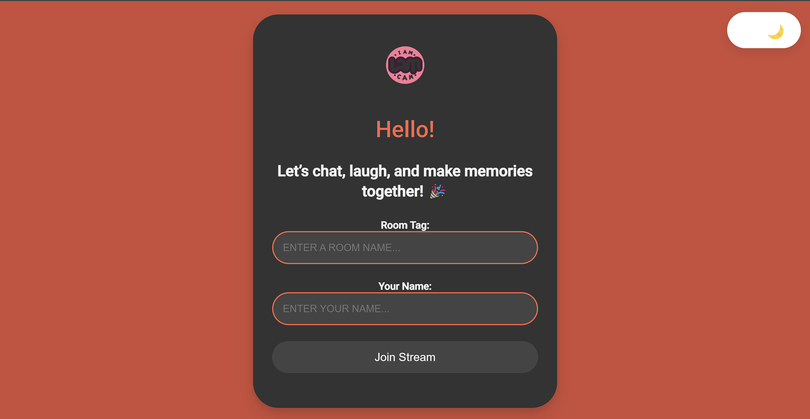

# Video Calling App using Agora and Django

This is a simple guide on how to create a video calling app using the Agora platform and Django framework. The app allows users to make video calls with each other in a web browser. Before you begin, make sure you have the necessary Agora API keys.


Mobile App
<p float="left">
  
  
</p>

WEB App



<br>In picture,
<br>@kamal - https://www.linkedin.com/in/kamalsonikgp/
<br>@sindhu - https://www.linkedin.com/in/sindhuvankudoth/
<br>@akshay - https://www.linkedin.com/in/akshaykumarid/
<br>@reeya - https://www.linkedin.com/in/reeya-agarwal-382502210/

## Prerequisites

- Python (3.6 or higher)
- Django (3.0 or higher)
- Agora Developer Account (API Key and App ID)
- Basic knowledge of HTML, CSS, and JavaScript

## Setup

1. Clone this repository to your local machine:
   ```
   git clone https://github.com/your-username/video-calling-app.git
   ```

2. Create a virtual environment to manage dependencies:
   ```
   python -m venv venv
   source venv/bin/activate  # On Windows: venv\Scripts\activate
   ```

3. Install required Python packages:
   ```
   pip install -r requirements.txt
   ```

4. Open `your_project/settings.py` and update the `ALLOWED_HOSTS` list to include your development server's IP or domain.

5. Replace `YOUR_AGORA_APP_ID` in `your_app/views.py` with your Agora App ID. It's recommended to use environment variables to store sensitive information like API keys.

6. Run migrations to set up the database:
   ```
   python manage.py migrate
   ```

7. Start the development server:
   ```
   python manage.py runserver
   ```

8. Access the app in your web browser at `http://127.0.0.1:8000/` and test the video calling functionality.

## Changing Agora API Key

For security reasons, you should never hardcode sensitive information like API keys directly in your code. To change the Agora API key in the `views.py` file, follow these steps:

1. Create a file named `.env` in the root directory of your project.

2. Add your Agora App ID and API Key to the `.env` file:
   ```
   AGORA_APP_ID=your_app_id
   AGORA_API_KEY=your_api_key
   ```

3. Update the `views.py` file to use these environment variables:
   ```python
   import os

   agora_app_id = os.environ.get('AGORA_APP_ID')
   agora_api_key = os.environ.get('AGORA_API_KEY')

   # Use agora_app_id and agora_api_key in your code
   ```

By using environment variables, you keep your sensitive information secure and separate from your codebase.

## Conclusion

Congratulations! You have successfully created a video calling app using Agora and Django. Users can now enjoy making video calls through your web application.

**Website Link:** [Video Calling App Demo](https://kamal3839.pythonanywhere.com/)

Feel free to customize and enhance the app's features according to your needs.

If you encounter any issues or have questions, refer to the official Agora and Django documentation for help.

Happy coding! 🚀
